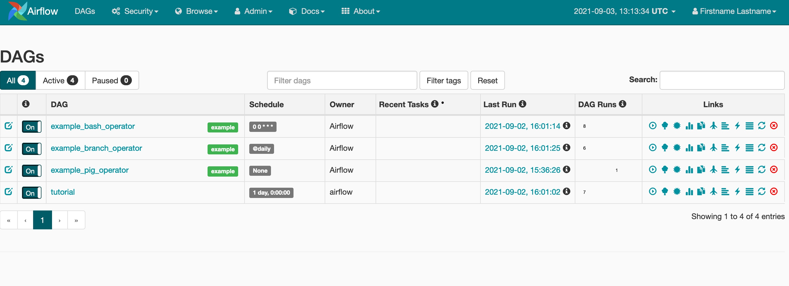

[](https://github.com/readybuilderone/serverless-airflow/actions/workflows/build.yml)
[](https://badge.fury.io/js/cdk-serverless-airflow)
[](https://badge.fury.io/py/cdk-serverless-airflow)


# `CDK Serverless Airflow`
CDK construct library that allows you to create [Apache Airflow](https://airflow.apache.org/) on AWS in TypeScript or Python

# Architecture


# Sample
``` typescript
import * as cdk from '@aws-cdk/core';
import * as airflow from 'cdk-serverless-airflow';

const app = new cdk.App();
const env = {
  region: process.env.CDK_DEFAULT_REGION,
  account: process.env.CDK_DEFAULT_ACCOUNT,
};
const stack = new cdk.Stack(app, 'airflow-stack', {
  env,
});
new airflow.Airflow(stack, 'Airflow');
```
# Airflow Dashboard 
> Default Credential: user/bitnami



# AWS China Regions

AWS China regions `cn-north-1` and `cn-northwest-1` are supported by this Library. 

## License

This project is licensed under the Apache-2.0 License.