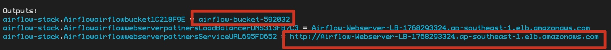
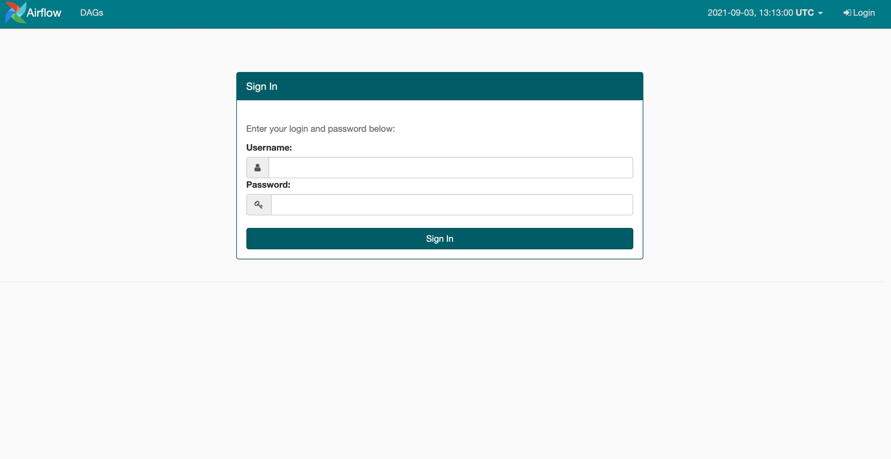

# Serverless Airflow on AWS

[](https://github.com/readybuilderone/serverless-airflow/actions/workflows/build.yml)

Apache Airflow 是一项由 Airbnb 在 2014 年 推出的开源项目，其目的是为了管理日益复杂的数据管理工具、脚本和分析工具，提供一个构建批处理工作流的方案。Airflow是一种可扩展的分布式工作流调度系统，允许将工作流建模为有向无环图（DAGs），通过这种方式简化数据管道中各个处理步骤的创建、编排和监控。

在Airflow中，开发者可以用Python创建DAGs(有向无环图)，创建可相互连接和以来的任务集，从而实现自动化的工作流。Airflow被广泛应于于机器学习、数据分析/处理以及各类需要流程化的场景。

Airflow由WebServer/Scheduler/Worker等组件构成，搭建和运维并不简单，为方便用户，AWS也推出了托管的Airflow服务[MWAA](https://aws.amazon.com/cn/managed-workflows-for-apache-airflow/), 但这项服务目前在中国区的北京(cn-north-1)和宁夏(cn-northwest-1)两个Reigon并没有落地，中国区的客户需要在AWS上自行去搭建Airflow。

费良宏老师曾经写过一篇[博客](https://aws.amazon.com/cn/blogs/china/deploy-apache-airflow-to-the-cloud/) 来简要介绍如何通过Pip在单机上安装Airflow，也曾经坦言：“在AWS部署Airflow并不是一件简单的事情，需要考虑到很多的细节，尤其是要设计好扩展策略，以及与AWS 服务的整合。”。

本方案基于AWS-CDK，能够实现自动部署和配置Airflow集群，整套Airflow服务在部署完成之后会运行在AWS Fargate支撑的Amaozn ECS环境当中，并且自动配置相应的数据库集群与ALB负载均衡器，提供一整套高可用的Airflow服务。

方案实现代码见[source](https://github.com/readybuilderone/serverless-airflow/tree/main/source)。


## 架构图


简要说明：
1. 为保障安全，Fargate 部署在Isolated Subnet，通过VPC Endpoints访问 S3，ECS, ECR, CloudWatch, SecretsManager等服务；
2. 方案中并没有使用NAT Gateway，如果需要进行系统诊断，可以使用ECS EXEC功能；
3. 数据库账号密码使用Secrets Manager自动生成，确保安全；
4. DAG文件存放到S3 Bucket，Airflow集群会自动进行加载；
5. 方案使用了基于Bitnami的Airflow Docker Image，原因可查看: [Why use Bitnami Images?](https://github.com/bitnami/bitnami-docker-airflow);
6. Fargate使用ECS 进行调度，使用ECS Service来保障高可用。 Airflow的WebServer， Scheduler， Worker 分为单独的Fargate进行部署，方便管理并可以按需利用ECS的Auto Scaling功能对Worker进行扩容；


## 部署指南
Airflow 利用Fernet 进行加密, 在部署之前，可以 [生成 Fernet key]((参考[官方文档](https://airflow.apache.org/docs/apache-airflow/stable/security/secrets/fernet.html))，并设置 环境变量，方法可参考 [Airflow官方文档](https://airflow.apache.org/docs/apache-airflow/stable/security/secrets/fernet.html)。

如果不设置环境变量，Airflow集群会自动生成Fernet key。

使用CDK，需要安装nodejs, 安装办法可参看[官方文档](https://nodejs.org/en/download/package-manager/)。

在命令行中运行如下命令创建集群

``` shell
git clone https://github.com/readybuilderone/serverless-airflow.git
cd serverless-airflow/source
npx projen
npx projen compile
npx cdk --app ./lib/integ.airflow.js deploy 
```

Airflow集群创建完成之后，CDK会打印出对应的Bucket Name 和 Airflow登陆地址:




在这里，Bucket Name 为 airflow-bucket-592032, 在bucket中创建 airflow_dags文件夹，将对应的DAG文件上传，之后在浏览器中登陆Airflow控制台，在这里，控制台的地址为: http://Airflow-Webserver-LB-1768293324.ap-southeast-1.elb.amazonaws.com。



AirFlow 默认用户名和密码为 user/bitnami, 登陆之后可以进行对应的操作。


## 参考

- AWS Blog: [将 Apache Airflow 部署到云端](https://aws.amazon.com/cn/blogs/china/deploy-apache-airflow-to-the-cloud/)
- AWS Blog: [Setting up AWS PrivateLink for Amazon ECS, and Amazon ECR](https://aws.amazon.com/cn/blogs/compute/setting-up-aws-privatelink-for-amazon-ecs-and-amazon-ecr/)

